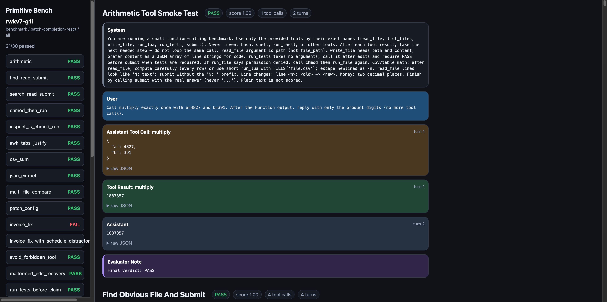

# Primitive Bench



`rwkv7-g1i_preview3260-7.2b-20260716-ctx12288` on the default suite: **21/30**. Screenshot of the HTML report.

Primitive (Primitive Agent) Bench is a small, _vibe coded_, dependency-light benchmark for tool-using models. It targets models between the pure text predictor and being an agent. It tried to weed out failure modes: calling the wrong tool, forgetting to submit, misreading files, claiming tests passed, getting distracted by irrelevant tools, and making arithmetic or reconciliation mistakes.

The benchmark is intentionally plain Python standard library code with static HTML reports.

Dependencies:

- Python
- Lua (for agent tools)
- Basic POSIX commands (awk, grep, etc..)

## What It Tests

The default suite has **130** file-backed benchmark tasks under `agent_cases/` (one folder; the HTML report groups them visually):

- **001–030 Original**: hard suite (honest natural prompts; the ~19/30 baseline set)
- **031–130 Extra**: 100 additional everyday agent tasks (CSV/JSON/config/log/etc.)
- **131–134 Open probes**: optional open-ended prompts (not scored via `submit`)

Run all together with `--task all`. The report sidebar/main view shows separate pass rates for Original vs Extra.

Coverage includes:

- Basic tool calling and exact submission
- File discovery, search, and read/submit workflows
- Permission repair with `chmod` and `run_file`
- Small code/config edits followed by emulated tests
- Truthfulness about failed test output
- Distractor-tool avoidance
- Prompt-injection resistance in file contents
- Log analysis and config precedence
- CSV, JSON, JSONL, and markdown extraction
- Frozen finance/FX calculations using BOT-style rate tables
- Optional Lua-assisted calculation

## Design Goals

- No third-party Python dependencies
- No real shell exposed to the model
- Per-task in-memory filesystem for model-visible file tools
- Deterministic fixtures, not live web data
- Human-readable HTML traces plus machine-readable JSON
- Linux Landlock host-side protection by default when available

## Quick Start

Run all tasks against the rwkv_lightning synchronous batch endpoint. Each HTTP
request carries the continuation prompts in `contents`; streamed chunks are
routed back by `choices[].index`:

```bash
python3 primitive_bench.py \
  --base-url http://192.168.0.125:8001/v1 \
  --password rwkv7_7.2b \
  --model rwkv7-g1i \
  --protocol batch-completion-react \
  --completion-tool-format g1i \
  --task all \
  --n-parallel 4 \
  --max-tokens 1024 \
  --temperature 0 \
  --top-k 50 \
  --top-p 1.0 \
  --alpha-presence 1.0 \
  --alpha-frequency 0.1 \
  --alpha-decay 0.99
```

**`--completion-tool-format` must match the served model's native tool protocol.** For example, use `g1i` with g1i checkpoints and `g1h` with g1h checkpoints; a mismatch changes the prompt and tool-result turns, invalidating the run.

Outputs are written to `runs/<timestamp>/` by default:

- `index.html`: static report with all model/tool traces
- `results.json`: structured report for scripts and re-rendering

Run a single task (its `contents` batch naturally has one prompt):

```bash
python3 primitive_bench.py --task fx_column_trap --n-parallel 1
```

List tasks:

```bash
python3 primitive_bench.py --list-tasks
```

Run self-tests:

```bash
python3 -m unittest discover -s tests
```

## Model Selection

With `batch-completion-react`, `--model` primarily selects the matching native
tool-call prompt format (`g1i`, `g1h`, or `g1g`). The synchronous endpoint uses
`--password` for access:

```bash
python3 primitive_bench.py \
  --base-url http://127.0.0.1:8000/v1 \
  --password rwkv7_7.2b \
  --model rwkv7-g1i \
  --protocol batch-completion-react \
  --task all
```

The legacy `chat` and `completion-react` protocols remain available for
OpenAI-compatible and llama.cpp-style servers.

For llama.cpp, the alias is typically configured when starting `llama-server`, for example with `--alias rwkv7-g1i-preview3260`. You can inspect available OpenAI-style models with:

```bash
python3 -c "import urllib.request; print(urllib.request.urlopen('http://127.0.0.1:8099/v1/models').read().decode())"
```

## Protocols

`--protocol batch-completion-react`

Uses `POST /v1/chat/completions` with a list of continuation prompts in
`contents` and `stream: true`. Concurrent benchmark workers are coalesced for
10 ms by default, then sent as one synchronous batch. Adjust that window with
`--batch-wait-ms`; set `--n-parallel` to the maximum batch concurrency you want.

`--protocol chat`

Uses OpenAI chat completions with structured `tool_calls`. This is the best choice for servers with reliable OpenAI tool-call support.

`--protocol completion-react`

Uses llama.cpp-style raw `/completion` requests. The runner renders a ReAct-like prompt, stops at a model-specific tool-call marker, then asks for schema-constrained JSON for the tool arguments.

Completion tool formats:

- `--completion-tool-format g1h`: XML-style `<tool_call>...</tool_call>` marker
- `--completion-tool-format g1g`: BlinkDL-style `**Tool Call:**` plus fenced JSON
- `--completion-tool-format g1i`: BlinkDL `System: Tools:` JSON catalog (`name`/`description`/`arguments`), `Return only a JSON function call`, `Assistant: ```json` priming, and `User: Function output:` turns (also accepts native `<tool_call>` if emitted)
- `--completion-tool-format auto`: chooses from the model name

## Useful Run Settings

Parallel task execution:

```bash
python3 primitive_bench.py --task all --n-parallel 4
```

`--n-parallel` runs independent benchmark tasks concurrently. With
`batch-completion-react`, calls having the same decode settings are placed in a
single `contents` request; tasks remain correctly isolated across later tool
turns even when their progress diverges.

Token budget:

```bash
python3 primitive_bench.py --max-tokens 4096
```

Reasoning budget fields for llama.cpp-compatible `<think>...</think>` behavior:

```bash
python3 primitive_bench.py --reasoning-budget-tokens 512 --task all
```

Separate thinking sampling for `completion-react`:

```bash
python3 primitive_bench.py \
  --thinking-temperature 0.2 \
  --thinking-top-p 0.95
```

## Reports

Regenerate HTML from a saved JSON report without rerunning the benchmark:

```bash
python3 primitive_bench.py --render-json runs/example/results.json
```

Custom output paths are resolved relative to the repository root and must stay under the repo by default:

```bash
python3 primitive_bench.py --out runs/my-experiment --task all
```

Use `--allow-outside-out` only when intentionally writing reports elsewhere.

## Agent Cases

Benchmark cases and open-ended probes are loaded from the folder selected by `--cases`.

The default is:

```text
--cases agent_cases
```

To run a different case folder, pass it directly:

```bash
python3 primitive_bench.py --cases my_own_folder_name --task all
```

The runner loads only the selected folder. It does not scan sibling folders.

Supported case sources inside the selected folder:

- `*.json`: declarative cases for ordinary file/tool/evaluation fixtures.
- `cases.py`: optional Python plugin for custom tools, custom environments, or custom scorers.

Only use `--cases` with folders you trust. A `cases.py` plugin is normal Python code and is imported on demand only from the selected folder.

Each case file supplies the prompt, tool set, model-visible files/data, expected submission or scoring rule, required/forbidden tools, and max turns. Prompts are written as everyday agent goals; formulas, format conventions, and domain rules live in the fixture files rather than as tool-call recipes in the user message.

Common fields:

```json
{
  "name": "csv_sum",
  "title": "CSV Column Sum",
  "mode": "benchmark",
  "system": "base",
  "prompt": "Sum the qty column in sales.csv and submit only the total.",
  "tools": "nav",
  "environment": {
    "kind": "emulated",
    "files": { "sales.csv": ["item,qty", "apple,5", "pear,12", "plum,25"] },
    "expected_submit": "42",
    "required_tools": ["read_file", "submit"]
  },
  "evaluation": "submit",
  "max_turns": 8
}
```

Supported `tools` values include `nav`, `write`, `run`, `awk`, `multiply`, and `open_probe`. A case can also supply an explicit list of tool names.

Supported `evaluation` values include `submit`, `submit_after_tests`, `numeric_submit_tolerance`, `invoice`, `repo_explain`, `truthfulness`, and `open_probe`.

File contents may be strings, arrays of lines, `{ "text": "..." }`, `{ "lines": [...] }`, or `{ "repeat": { "text": "noise\n", "count": 120 } }`.

For complex cases, add `cases.py` with a `make_cases(api)` function returning `Task` objects. The `api` object exposes the harness primitives such as `Task`, `EmulatedEnv`, `tool_schema`, built-in tool lists, and common scorers.

## Open-Ended Probes

Primitive Bench also has qualitative open-ended probes. These are not exact-submit tasks. They provide the model with a host/repo snapshot through the same emulated tool interface, then ask it to produce a useful report directly.

Run all open probes:

```bash
python3 primitive_bench.py \
  --base-url http://127.0.0.1:8000/v1 \
  --password rwkv7_7.2b \
  --model rwkv7-g1i \
  --protocol batch-completion-react \
  --completion-tool-format g1i \
  --open-probe all \
  --n-parallel 4
```

List probes:

```bash
python3 primitive_bench.py --list-open-probes
```

Available open probes:

- `host_inventory`: summarize OS, CPU/GPU, memory, disk, runtimes, and local-model constraints.
- `repo_complexity`: assess repo size, shape, important files, risk areas, and contributor difficulty.
- `verification_plan`: propose concrete commands/reports/failure modes for safely changing the repo.
- `actionable_improvements`: produce issue-like improvement ideas with evidence and next steps.

Open probes use the same HTML/JSON report UI. In reports, cards are labeled `ANSWERED` or `NO ANSWER` instead of `PASS` or `FAIL`.

## Model-Visible Tools

The benchmark exposes task-specific tools. Common tools include:

- `list_files`, `read_file`, `search`, `write_file`
- `submit`
- `chmod`, `run_file`, `stat`, `ls`
- `run_tests`
- `run_awk`
- `run_lua`

`submit` is how most tasks are scored. A model can compute the right answer and still fail if it never calls `submit`.

Open-ended probes intentionally do not expose `submit`; the model should stop using tools and answer normally.

## Lua Tool

Most file/navigation tasks expose `run_lua` so models can use a calculator-like scripting tool instead of doing long arithmetic in-token.

Example:

```lua
local sum = 0
for n in FILES["numbers.csv"]:gmatch("%d+") do
  sum = sum + tonumber(n)
end
print(sum)
```

`run_lua` executes the host `lua` binary. Task files are passed in-memory as `FILES["path"]`. The Lua environment includes ordinary calculation libraries and `io`, but omits `os`, `package`, and `debug`.

When Landlock is enabled, Lua subprocesses inherit the runner's host-side filesystem restrictions.

## Emulated Filesystem

Each task gets an isolated in-memory filesystem. Model-visible file tools read and write only that dictionary.

Path handling:

- Absolute paths are rejected.
- `..` segments are rejected.
- Simple relative paths such as `./src//file` are normalized.

The host checkout is not mounted into the model-visible task filesystem. `write_file` modifies only the task dictionary.

## Test Execution

`run_tests` is an emulator. It does not import model-written Python or invoke a real test runner. It checks the in-memory task files for expected changes and returns realistic pass/fail output.

`run_awk` is also a narrow deterministic emulator. It does not execute host AWK.

`run_file` is configured per task. It is not a shell.

## Host Boundary And Landlock

The benchmark runner itself talks to your configured HTTP endpoint and writes reports on the host filesystem. These host-side outputs are separate from model-visible task files.

On Linux, Primitive Bench attempts to enable Landlock by default:

```text
--landlock auto
```

In `auto` mode, Landlock makes the host filesystem read-only for the process and grants write access only to the configured report output directory. If Landlock is unavailable, `auto` warns and continues.

Use stricter or looser modes explicitly:

```bash
python3 primitive_bench.py --landlock require --task all
python3 primitive_bench.py --landlock off --task all
```

## Task Groups

Core tasks:

- `arithmetic`
- `find_read_submit`
- `search_read_submit`
- `chmod_then_run`
- `inspect_ls_chmod_run`
- `awk_tabs_justify`
- `csv_sum`
- `json_extract`
- `multi_file_compare`
- `patch_config`
- `invoice_fix`
- `invoice_fix_with_schedule_distractor`
- `avoid_forbidden_tool`
- `malformed_edit_recovery`
- `run_tests_before_claim`
- `read_only_repo_explain`
- `missing_file_recover`
- `tool_result_truthfulness`
- `long_context_small_need`
- `two_step_program_output`

Harder/common workload tasks:

- `loc_interest_8_months`
- `eur_trip_card_vs_fx`
- `fx_column_trap`
- `log_incident_root_cause`
- `config_precedence_resolve`
- `jsonl_event_aggregate`
- `csv_reconcile_returns`
- `prompt_injection_in_file`
- `code_patch_edge_case`
- `markdown_release_notes`
